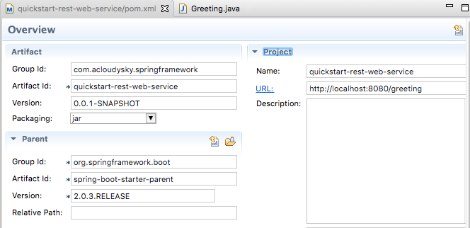

# quickstart-rest-web-service
This project shows how to create a [RESTful Web Service](https://spring.io/understanding/REST). You can download the exanmples source code at [sprinf-guides/gs-rest-service](https://github.com/spring-guides/gs-rest-service).  

## Overview
The Web service accepts **GET requests** at:

	http://localhost:8080/greeting

It responds with a **JSON representation** of a greeting:

	{"id":1,"content":"Hello, World!"}

You can customize the greeting with an optional name parameter in the query string:

	http://localhost:8080/greeting?name=UserName

The name parameter value overrides the default value of "World" and is reflected in the response:

	{"id":1,"content":"Hello, UserName!"}

## Prerequisites
1. Eclipse IDE.
2. Assure that [JDK 1.8](http://www.oracle.com/technetwork/java/javase/downloads/index.html) or later is installed.
3. [Maven 3.2](https://maven.apache.org/download.cgi).   

## Steps
1. Actiivate Eclipse IDE.
2. From the menu bar select **File->New->Other-Maven** Project.
3. In the pom UI enter information similar to the following:

2. To the initial add the information shown next:

		<project xmlns="http://maven.apache.org/POM/4.0.0" xmlns:xsi="http://www.w3.org/2001/XMLSchema-instance"
		xsi:schemaLocation="http://maven.apache.org/POM/4.0.0 	http://maven.apache.org/xsd/maven-4.0.0.xsd">
		<modelVersion>4.0.0</modelVersion>
		
		<groupId>com.acloudysky.springframework</groupId>
		<artifactId>quickstart-rest-web-service</artifactId>
		<version>0.0.1-SNAPSHOT</version>
		<packaging>jar</packaging>
		<name>quickstart-rest-web-service</name>
		<url>http://localhost:8080/greeting</url>
		
		<parent>
		  <groupId>org.springframework.boot</groupId>
		  <artifactId>spring-boot-starter-parent</artifactId>
		  <version>2.0.3.RELEASE</version>
		</parent>

	    <dependencies>
	        <dependency>
	            <groupId>org.springframework.boot</groupId>
	            <artifactId>spring-boot-starter-web</artifactId>
	        </dependency>
	        <dependency>
	            <groupId>org.springframework.boot</groupId>
	            <artifactId>spring-boot-starter-test</artifactId>
	            <scope>test</scope>
	        </dependency>
	        <dependency>
	            <groupId>com.jayway.jsonpath</groupId>
	            <artifactId>json-path</artifactId>
	            <scope>test</scope>
	        </dependency>
	    </dependencies>
    
		  	<properties>
		    	<project.build.sourceEncoding>UTF-8
		    	</project.build.sourceEncoding>
		  	</properties>

			<build>
		        <plugins>
		            <plugin>
		                <groupId>org.springframework.boot</groupId>
		                <artifactId>spring-boot-maven-plugin</artifactId>
		            </plugin>
		        </plugins>
		    </build>
		
		    <repositories>
		        <repository>
		            <id>spring-releases</id>
		            <url>https://repo.spring.io/libs-release</url>
		        </repository>
		    </repositories>
		    <pluginRepositories>
		        <pluginRepository>
		            <id>spring-releases</id>
		            <url>https://repo.spring.io/libs-release</url>
		        </pluginRepository>
		    </pluginRepositories>
  
		</project>
	After the project setup; let's now build the actual web service.	
3. **Resource Representation Class**. Let's remember that the service must handle a **GET** request for */greetings*, with an optional *name* parameter in the query string. The request must return a **200 OK** response in *JSON* format in the body, which represents a greeting. The response should look like this:

		{
			"id": 1,
			"content": "Hello, World!" 
		}  

Where:
	- **id** is a unique identifier for the greeting.
	- **content** is the greetign textual representation.

To **model the greeting representation**, you must **create a resource representation class**. Provide a plain old java object with fields, constructors, and accessors for the id and content data as shown next:
	
		package com.acloudysky.springframework.quickstart_rest_web_service;
		
		public class Greeting {

		    private final long id;
		    private final String content;
		
		    public Greeting(long id, String content) {
		        this.id = id;
		        this.content = content;
		    }
		
		    public long getId() {
		        return id;
		    }
		
		    public String getContent() {
		        return content;
		    }
		}

	
4. **Resource Controller Class**.  In Spring’s when building RESTful web services, HTTP requests are handled by a controller. These components are easily identified by the **@RestController** annotation. You can see this in the **GreetingController** class below which handles GET requests for */greeting* by returning a new instance of the **Greeting** resource class.

As you see in steps below, Spring uses the Jackson JSON library to automatically marshal instances of type Greeting into JSON.

		package com.acloudysky.springframework.quickstart_rest_web_service;

		import java.util.concurrent.atomic.AtomicLong;
		import org.springframework.web.bind.annotation.RequestMapping;
		import org.springframework.web.bind.annotation.RequestParam;
		import org.springframework.web.bind.annotation.RestController;
		
		@RestController
		public class GreetingController {

		   	private static final String template = "Hello, %s!";
		   	private final AtomicLong counter = new AtomicLong();
		
		    @RequestMapping("/greeting")
		    public Greeting greeting(@RequestParam(value="name", defaultValue="World") String name) {
		        return new Greeting(counter.incrementAndGet(),
		                            String.format(template, name));
		    }
		}
Let's analyze the GreetingController class which is deceptively simple but it implements very important Spring's concepts.

-	The class uses Spring 4’s new **@RestController** annotation, which marks the class as a controller allowing every method to return a domain object instead of a view. It’s shorthand for @Controller and @ResponseBody rolled together. In this example, it returns a resource representation class Greeting obiect. 

  A key difference between a traditional MVC controller and the RESTful web service controller above is the way that the HTTP response body is created. Rather than relying on a view technology to perform server-side rendering of the greeting data to HTML, this RESTful web service controller simply populates and returns a Greeting object. The object data will be written directly to the HTTP response as JSON. The Greeting object is converted to JSON thanks to Spring’s HTTP message converter support; you don’t need to do this conversion manually. Because Jackson 2 is on the classpath, Spring’s MappingJackson2HttpMessageConverter is automatically chosen to convert the Greeting instance to JSON.

- 	The **@RequestMapping** annotation ensures that HTTP requests to /greeting are mapped to the greeting() method. 
  The above example does not specify GET vs. PUT, POST, and so forth, because @RequestMapping maps all HTTP operations by default. If you want to narrow the mapping to GET only, use @RequestMapping(method=GET) instead.

-  The **@RequestParam** annotation binds the value of the query string parameter *name* into the name parameter of the greeting() method. If the *name* parameter is absent in the request, the defaultValue of "World" is used.
-  Finally, the implementation of the method body creates and returns a new Greeting object with id and content attributes based on the next value from the counter, and formats the given name by using the greeting template.

##References

- [Spring Framework Overview](https://docs.spring.io/spring/docs/current/spring-framework-reference/overview.html#overview-spring)
- [Spring Site by Pivotal](http://spring.io)
- [REST in a Nutshell](https://spring.io/understanding/REST)

